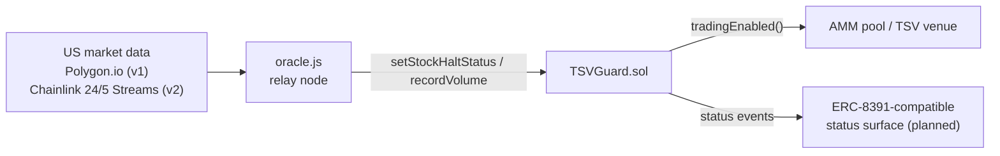

# Aegis

**The compliance circuit breaker for tokenized equities.**

On-chain compliance shield for Tokenized Securities Venues (TSVs) operating
under the SEC **Innovation Exemption** issued on 2026-09-17 (press release
[2026-90](https://www.sec.gov/newsroom/press-releases/2026-90-sec-issues-innovation-exemption-facilitate-trading-tokenized-nms-stock-request-comment)).

A Tokenized Securities Venue (TSV) operating under the exemption must, among
other conditions, (a) stop trading a tokenized stock concurrently with any
halt of the underlying NMS stock on its primary listing exchange, and
(b) enforce per-symbol volume caps (0.25% / 2.5% of prior-month ADV by tier).
This middleware puts both conditions on-chain so any AMM or venue can
inherit them with a single check.

## Scope & disclaimer

TSV Aegis is open-source developer tooling and a reference implementation.
It does not operate a trading venue, issue securities, provide brokerage
services, custody assets, perform KYC/AML, or guarantee regulatory
compliance. Market-data integrations are optional, subject to provider
entitlements, and require independent validation by each deployer.

The Base Sepolia deployment uses simulated events and test assets only. It
is not production infrastructure and must not be used to facilitate live
securities trading.

## Architecture



The data-source side is pluggable: v1 relays Polygon.io LULD signals, v2
adds a native Chainlink 24/5 U.S. Equities Streams adapter
([#4](https://github.com/themis-labs/tsv-aegis/issues/4)). The execution
side will expose halt status through an ERC-8391-compatible interface so
integrators read a standard enum instead of project-specific getters
([#3](https://github.com/themis-labs/tsv-aegis/issues/3)).

Two independent stop conditions, two separate flags:

- **Market halt** — relayed from LULD signals; matches the order's
  concurrent-stoppage condition.
- **Daily volume cap** — recorded volume is tallied per UTC day with lazy
  rollover; hitting the cap disables trading until the next day.

Keeping the flags separate matters: a day rollover must never clear an
active market halt. Day rollover is lazy (derived from `block.timestamp`)
with a permissionless `rollDay()` that Keepers-style automation can call.

## Current scope — and what it is not

This repo is the v1 reference implementation. The oracle is a single relay
key (`ORACLE_ROLE`), and volume accounting is recorded by the relay rather
than intercepted inside the swap path. The production evolution (see Roadmap
below) replaces these with: multi-source threshold signatures
(2-of-3), private-mempool submission for halt transactions, Uniswap v4
`beforeSwap` atomic interception, and ERC-3643 `canTransfer` coverage for
off-venue transfers. Coverage is limited to pools and tokens that integrate
the guard — liquidity elsewhere is out of scope by design.

## Roadmap

- **v1 (this repo)** — Polygon.io LULD relay, single `ORACLE_ROLE`,
  relay-recorded volume accounting. Goal: prove the two stop conditions
  on-chain with minimal surface.
- **v2** — ERC-8391-compatible asset status surface
  ([#3](https://github.com/themis-labs/tsv-aegis/issues/3)); Chainlink
  24/5 U.S. Equities Streams as a native on-chain status source, removing
  the single-relay trust assumption
  ([#4](https://github.com/themis-labs/tsv-aegis/issues/4)).
- **Production hardening** — multi-source threshold signatures (2-of-3),
  private-mempool submission for halt transactions, Uniswap v4
  `beforeSwap` atomic interception, ERC-3643 `canTransfer` coverage for
  off-venue transfers.

Halt synchronization minimizes the cross-market arbitrage window; it does
not promise zero-latency parity with the primary exchange — propagation
and block times always apply.

## Data source notes

`oracle.js` subscribes to Polygon.io's stocks WebSocket (`LULD.<ticker>`).
That channel requires a plan that includes it; without the entitlement,
fall back to polling SIP market status over REST and call the same
`setStockHaltStatus` interface. The v2 Chainlink adapter consumes the
24/5 equities streams' market-status field instead, which removes the
polling trust assumption entirely.

## Quick start (Base Sepolia)

Aegis is deployed on [Base](https://base.org). The guard contract is plain
EVM — the same bytecode runs on any OP Stack or Ethereum chain, but Base is
the reference deployment and the network the oracle relay defaults to.

```bash
npm install
cp .env.example .env   # fill in PRIVATE_KEY (testnet), POLYGON_API_KEY
npm run compile
npm test               # unit tests: halt/resume, cap breach, day rollover, ACL

npm run deploy:base-sepolia
# paste the deployed address into .env as GUARD_ADDRESS, then:
npm run start:oracle
```

For mainnet, use `npm run deploy:base` with `BASE_RPC` and a funded deployer
key. Arbitrum Sepolia remains available via `npm run deploy:arbitrum-sepolia`
for cross-chain testing.

With `VERIFY=true` and an [Etherscan V2](https://docs.etherscan.io/) API key
set (one key covers Basescan, Arbiscan, and Etherscan), deployment also
verifies the contract source on the explorer.

## Deployment record (Base Sepolia)

- **Network:** Base Sepolia
- **Chain ID:** 84532
- **TSVGuard:** [`0xBAcaF3d2765dcc314ee22CB19b87Cf755f5A6433`](https://sepolia.basescan.org/address/0xBAcaF3d2765dcc314ee22CB19b87Cf755f5A6433)
- **Deploy tx:** [`0x897e003291749bbca87e3e64c1c8b3d96d846fb606228f6f49f17c8972de87c8`](https://sepolia.basescan.org/tx/0x897e003291749bbca87e3e64c1c8b3d96d846fb606228f6f49f17c8972de87c8)
- **Source verification:** [verified on Basescan](https://sepolia.basescan.org/address/0xBAcaF3d2765dcc314ee22CB19b87Cf755f5A6433#code)
- **Deployed from commit:** `b9adc62c801ad3ba50b076a424867d8650faa9d7`
- **Live demo:** [themis-labs.github.io/tsv-aegis/demo](https://themis-labs.github.io/tsv-aegis/demo/) — read the guard state, relay a mock halt, or fire a trade against the demo venue straight from a wallet

End-to-end halt rehearsal against this deployment (full terminal log:
[`docs/e2e-simulation-base-sepolia.log`](docs/e2e-simulation-base-sepolia.log)):

| Step                                            | Tx hash                                                              |
| ----------------------------------------------- | -------------------------------------------------------------------- |
| Pre-halt trade (succeeded)                      | `0x630f812cdb91159379280095c7ba44435ab752367efa95ea26c42071cafac8c0` |
| Mock LULD halt signal (`setStockHaltStatus`)    | `0x5a9ea0a774c9cc04d2bffbfcd60f2da6c5af875d63710943d57b6c7586778a43` |
| Trade during halt (reverted on-chain, as mined) | `0x59862278eb772163d309740cec7249ea1c6905a733bb61cb4f69b65b8150c16d` |
| Resume signal                                   | `0xeb7d05e83056758da671b68621b08d7b6e6548833f4e4915a99cd4694d49b350` |
| Post-resume trade (succeeded)                   | `0x8cbbc6e47103d8cf3ff2c2c56f2baac079da3e02b130d467d1d79e59e88ae1ef` |

All transactions are test assets on a public testnet; see the disclaimer
above.

## Repository layout

```
contracts/TSVGuard.sol          core guard contract (AccessControl, dual stop flags)
contracts/interfaces/ITSVGuard.sol  integration surface for AMMs / venues
contracts/test/MockVenue.sol    demo venue honoring the guard, used by the e2e simulation
scripts/deploy.js               cross-chain deploy + optional source verification
scripts/oracle.js               LULD listener relaying halt signals on-chain
scripts/simulate.js             end-to-end halt simulation against a deployed guard
test/TSVGuard.test.js           unit tests
docs/e2e-simulation-base-sepolia.log  recorded e2e halt rehearsal on Base Sepolia
docs/demo/index.html          wallet-driven live demo against the Base Sepolia deployment
```

## Compliance mapping

| Exemption condition                                     | On-chain mechanism                                                                 |
| ------------------------------------------------------- | ---------------------------------------------------------------------------------- |
| Concurrent stoppage with underlying NMS stock           | `setStockHaltStatus` relayed from LULD feed, gate via `tradingEnabled()`           |
| Volume limits (0.25% / 2.5% of prior-month ADV by tier) | `recordVolume` + `maxDailyCap`, per-UTC-day tally, cap update via `setMaxDailyCap` |
| Auditable, public contracts on a permissionless ledger  | MIT-licensed source, verified on explorer, deployed to public testnets/mainnets    |

Regulatory references: SEC press release 2026-90 and the underlying order
(2026-09-17). The exemption is open for public comment; conditions may be
revised — check the current order text before relying on specific numbers.

## License

MIT
